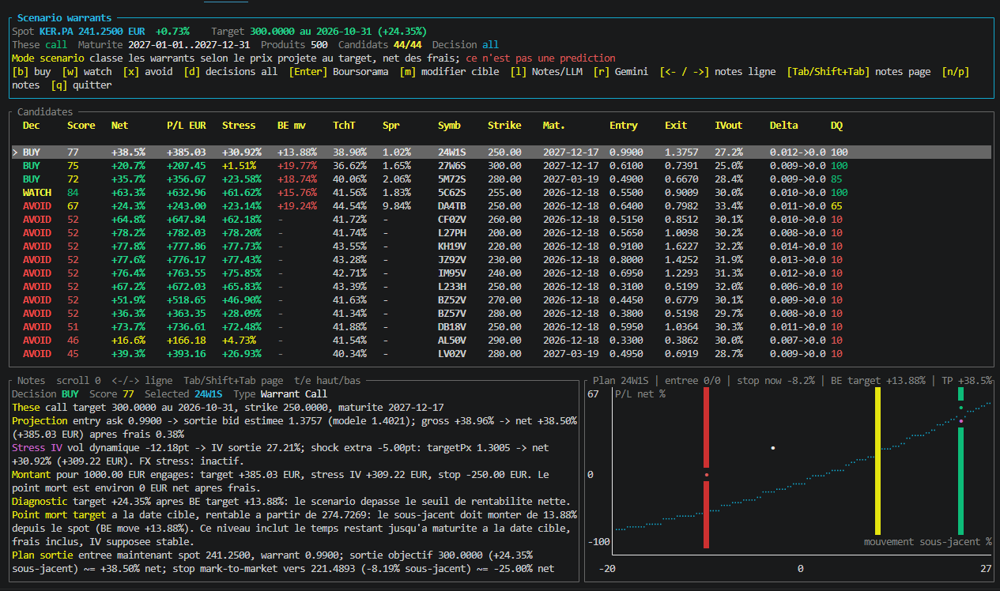

# Warrant Fetcher

Outil Rust/Docker pour decouvrir, parser et analyser des warrants, turbos et produits structures cotes sur Boursorama/Euronext. L'application sert de screener quantitatif: elle calcule des signaux, des scenarios, des plans de sortie, des frais, des stress IV/FX et peut demander un audit qualitatif a Gemini.



> Les resultats sont des indicateurs d'analyse, pas des recommandations d'investissement. Les warrants peuvent perdre 100% de leur valeur.

## Fonctionnalites

- Decouverte de produits par sous-jacent: Hermes, Kering, Apple, etc.
- Parsing strict des fiches Boursorama/Euronext: bid/ask, strike, maturite, parite, devise, emetteur, type de produit.
- Nettoyage de donnees: rejet des prix non executables, ask/bid a zero, prix stale, spreads aberrants et incoherences de devise.
- Analyse `opportunities`: detection de decorellations relatives entre produits comparables.
- Mode `scenario`: recherche des meilleurs warrants pour une these humaine, par exemple "AAPL a 330 USD fin octobre 2026".
- En mode `SCENARIO_SIDE=auto`, les calls et les puts sont tous recalcules: un produit nominalement oppose a la these peut donc apparaitre si son prix projete devient interessant via IV, theta ou convexite.
- Pricing Black-Scholes, IV, greeks, theta, stress de volatilite, stress FX, dividendes discrets et penalite de spread de sortie.
- Caches locaux pour les bougies et les audits LLM afin d'eviter de consommer trop de credits API.
- Interface terminal Ratatui avec tableau, notes, droite de decision et onglet Gemini.

## Installation

Prerequis:

- Docker
- Bash/WSL ou environnement compatible avec `./manage.sh`

Construire l'image:

```bash
./manage.sh build
```

Configurer l'environnement:

```bash
cp .env.example .env
```

Puis editer `.env` avec tes cles optionnelles: Gemini, ORATS, Polygon.

## Commandes Rapides

Telecharger les bougies et les mettre en cache:

```bash
./manage.sh candles AAPL 60d 60m refresh
./manage.sh candles RMS.PA 60d 60m refresh
./manage.sh candles KER.PA 60d 60m refresh
```

Relancer ensuite en utilisant le cache:

```bash
MARKET_DATA_REFRESH=cache ./manage.sh candles AAPL 60d 60m cache
```

Analyser les opportunites relatives:

```bash
BROKER_FEE_PROFILE=bourse_direct_1000 FEE_ORDER_NOTIONAL=1000 \
CANDLES_RANGE=60d CANDLES_INTERVAL=60m MARKET_DATA_REFRESH=cache \
./manage.sh opportunities apple AAPL 500 all
```

Lancer un scenario Apple:

```bash
BROKER_FEE_PROFILE=bourse_direct_1000 FEE_ORDER_NOTIONAL=1000 \
CANDLES_RANGE=60d CANDLES_INTERVAL=60m MARKET_DATA_REFRESH=cache \
LLM_ENABLE=1 \
./manage.sh scenario apple AAPL 330 2026-10-31 2027-01-01 2027-03-31 auto 500
```

Lancer un scenario Hermes:

```bash
BROKER_FEE_PROFILE=bourse_direct_1000 FEE_ORDER_NOTIONAL=1000 \
CANDLES_RANGE=60d CANDLES_INTERVAL=60m MARKET_DATA_REFRESH=cache \
LLM_ENABLE=1 \
./manage.sh scenario hermes RMS.PA 1300 2026-10-31 2027-01-01 2027-03-31 auto 500
```

Lancer un scenario Kering:

```bash
BROKER_FEE_PROFILE=bourse_direct_1000 FEE_ORDER_NOTIONAL=1000 \
CANDLES_RANGE=60d CANDLES_INTERVAL=60m MARKET_DATA_REFRESH=cache \
LLM_ENABLE=1 \
./manage.sh scenario kering KER.PA 300 2026-10-31 2027-01-01 2027-12-31 auto 500
```

Tests:

```bash
./manage.sh test-unit
```

## Interface

Dans le mode `scenario`:

- `b`, `w`, `x`: filtrer BUY / WATCH / AVOID
- `d`: revenir a toutes les decisions
- `m`: modifier la cible sans quitter l'application
- `l`: basculer entre Notes et LLM
- `r`: demander un audit Gemini du candidat selectionne
- fleches gauche/droite, `Tab`, `Shift+Tab`, `n`, `p`, `t`, `e`: scroller les notes
- `Enter`: ouvrir le lien Boursorama si l'environnement le permet
- `q`: quitter

## Lecture Du Mode Scenario

Les colonnes principales:

- `Net@D`: rendement net projete a la date cible, apres frais et spread de sortie estime.
- `P/L@D`: gain ou perte estimee a la date cible pour `FEE_ORDER_NOTIONAL`.
- `Str@D`: rendement net a la date cible avec stress de volatilite implicite.
- `BE mv`: mouvement minimum du sous-jacent pour atteindre le point mort.
- `Tch<=D`: probabilite first-touch d'atteindre la cible avant ou a la date scenario.
- `Spr`: spread courant.
- `EntryAsk`: prix d'entree acheteur utilise.
- `ExitBid@D`: prix de sortie bid estime a la date cible, hors frais broker.
- `IVout`: volatilite utilisee a la sortie apres ajustement dynamique.
- `DQ`: qualite des donnees.

La droite de decision place les niveaux importants sur un seul axe de mouvement du sous-jacent:

- `S`: spot actuel, point d'entree normalise a 0%
- `X`: stop mark-to-market, zone ou le produit atteint la perte maximale configuree
- `B`: breakeven, niveau ou le trade n'est plus perdant apres frais
- `T`: target, sortie theorique du scenario

Cette representation est volontairement une droite, pas une courbe de prix: elle ne montre pas une prediction du marche, seulement l'ordre des seuils utiles pour decider.

## Configuration Importante

Extrait utile de `.env`:

```env
BROKER_FEE_PROFILE=bourse_direct_1000
FEE_ORDER_NOTIONAL=1000

CANDLES_RANGE=60d
CANDLES_INTERVAL=60m
MARKET_DATA_REFRESH=cache

SCENARIO_SIDE=auto
SCENARIO_MIN_BUY_RETURN_PCT=8
SCENARIO_MIN_BUY_SCORE=70
SCENARIO_VOL_SHOCK_POINTS=-5
SCENARIO_VOL_SPOT_SLOPE_POINTS_PER_PCT=-0.50
SCENARIO_EXIT_SPREAD_MULTIPLIER=1.5

LLM_ENABLE=1
GEMINI_API_KEY=gemini_key_1,gemini_key_2
GEMINI_MODEL=gemini-3-pro-preview
LLM_CACHE=1
```

`SCENARIO_SIDE=auto` est le mode recommande: il ne force plus uniquement `call` quand la cible est au-dessus du spot ou `put` quand elle est en-dessous. Le moteur calcule les deux cotes et classe ensuite les produits selon le P/L projete. Utilise `call` ou `put` seulement si tu veux volontairement exclure l'autre cote.

`GEMINI_API_KEY`, `ORATS_API_KEY` et `POLYGON_API_KEY` acceptent plusieurs cles separees par des virgules. Si une cle echoue ou est rate-limitee, l'application essaie la suivante.

## Documentation

- [Documentation de l'application](docs/application-documentation.md)
- [Documentation technique et logique](docs/technical-and-logic.md)
- [Plan d'implementation trading](docs/trade-plan-implementation-plan.md)

## Notes Financier

Le moteur combine des calculs deterministes et des heuristiques:

- Black-Scholes pour les warrants vanille
- valeur intrinseque/parite pour les produits a financement
- conversion FX lorsque le sous-jacent et le produit ne sont pas dans la meme devise
- nettoyage strict des prix executables
- frais broker, spread actuel et spread estime a la sortie
- stress de volatilite implicite et de change

Le module Gemini est un auditeur qualitatif. Il ne remplace pas le moteur quantitatif et ne doit pas etre utilise comme conseil financier.
